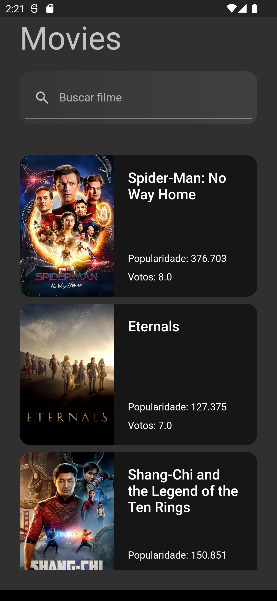
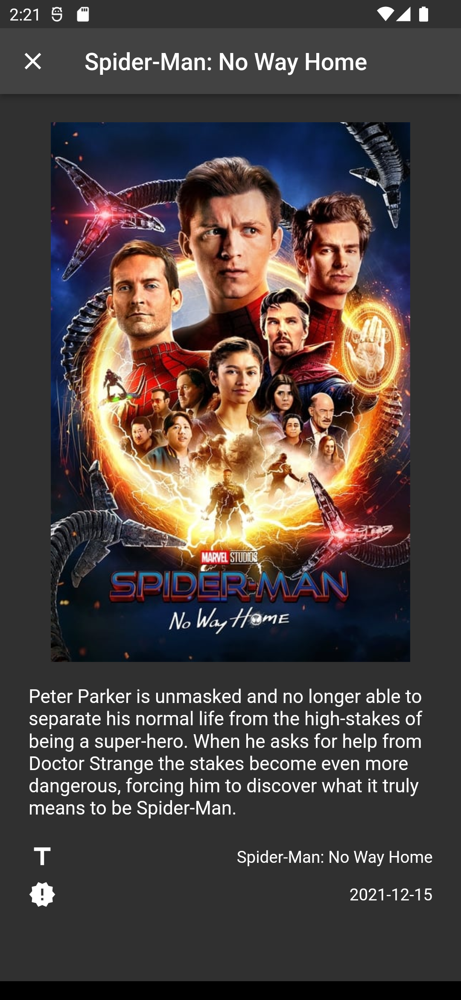

# flutter_movie

```
https://www.themoviedb.org/
https://developers.themoviedb.org/4/list/get-list
```

## Converter json em Model dart
```
https://www.dripcoding.com/json-to-dart/
```

## packages

- [dio](https://pub.dev/packages/dio)
- [lottie](https://pub.dev/packages/lottie)
- [shared_preferences](https://pub.dev/packages/shared_preferences)
- [cached_network_image](https://pub.dev/packages/cached_network_image)
- [get_it](https://pub.dev/packages/get_it)
- [dartz](https://pub.dev/packages/dartz)
- [flutter_dotenv](https://pub.dev/packages/flutter_dotenv)

## Screens
<br>
<div align="center">
    
    
</div>
